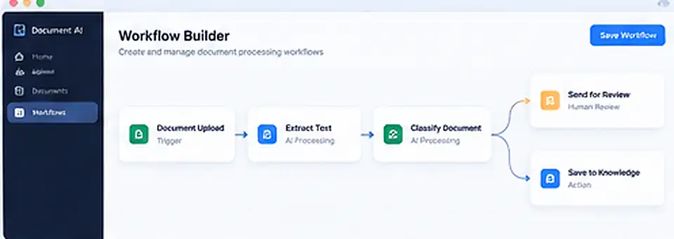
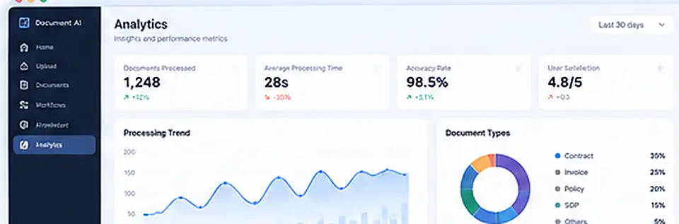

# MYH Frontend

A reusable Agent Skill for building calm, modern, production-grade enterprise frontends, especially AI, document, data, and operations products.

The skill is intentionally framework-aware but framework-neutral: it inspects the existing application first and improves the current stack instead of rewriting it for aesthetics.

## Preview

These are illustrative UI directions for the kinds of enterprise surfaces this skill is designed to produce. Click any image to open the larger preview.

### Enterprise AI dashboard

<a href="assets/preview-dashboard.webp">
  
</a>

### Login portal

<a href="assets/preview-login.webp">
  
</a>

### Workflow builder

<a href="assets/preview-workflow-builder.webp">
  
</a>

### Analytics dashboard

<a href="assets/preview-analytics.webp">
  
</a>

## What it optimizes for

- Clear task hierarchy instead of card walls
- Enterprise-flat visual language with restrained depth and motion
- Accessible interaction, keyboard support, and responsive behavior
- Explicit state, scope, risk, cost, approval, and side effects for governed AI workflows
- Compact AI/Agent experiences that separate conversation from execution state
- Production-ready implementation and verification, not mockup-only output

## Install

Copy the skill directory into a repository:

```bash
mkdir -p .agents/skills
cp -R .agents/skills/myh-frontend <target-repo>/.agents/skills/
```

For clients that still require a vendor-specific skills directory, copy the same `myh-frontend` folder to that client's supported skill path. Keep one canonical source of the skill to avoid drift.

## Use

Typical prompts:

```text
Use $myh-frontend to redesign this dashboard without changing the backend contracts.
```

```text
Use $myh-frontend to review the current frontend and implement the highest-impact UX and accessibility fixes.
```

```text
Use $myh-frontend to build an enterprise AI approval flow with clear scope, risk, cost, and audit states.
```

## Public-safe derivation

This repository contains reusable design and engineering principles only. It does not include proprietary source code, private product assets, credentials, customer data, or copied internal implementation files.

## License

MIT
